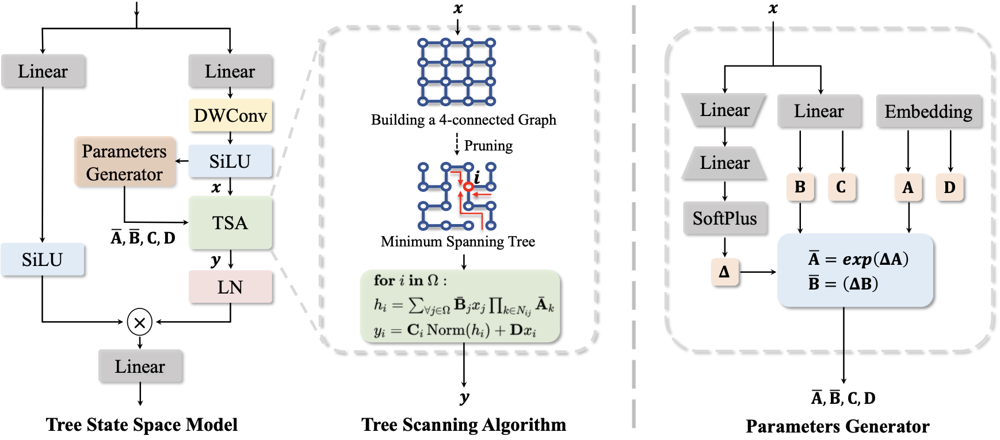
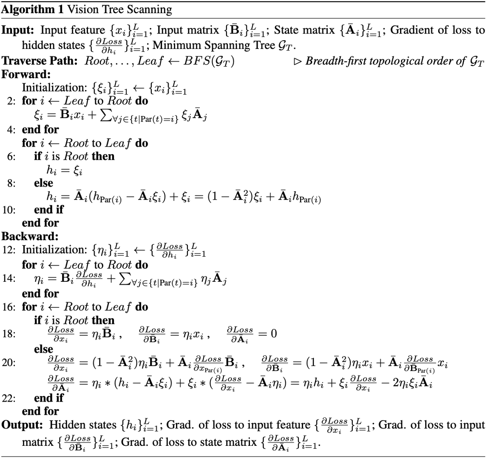
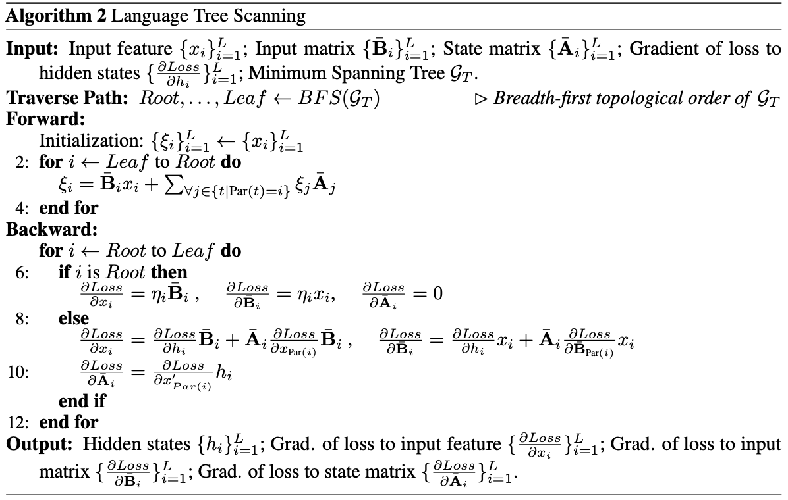

# 🌲 GrootVL: Tree Topology is All You Need in State Space Model
[Yicheng Xiao<sup><span>1,*</span></sup>](https://easonxiao-888.github.io/), [Lin Song<sup><span>2,3,📧,*</span></sup>](https://linsong.info/), [Shaoli Huang<sup>3</sup>](https://scholar.google.com/citations?user=o31BPFsAAAAJ&hl=en&oi=ao), [Jiangshan Wang<sup><span>1</span></sup>](https://scholar.google.com/citations?hl=en&user=HoKoCv0AAAAJ), [Siyu Song<sup><span>4</span></sup>](), [Yixiao Ge<sup><span>2,3</span></sup>](http://geyixiao.com/), [Xiu Li<sup><span>1,📧</span></sup>](https://www.sigs.tsinghua.edu.cn/lx/main.htm) and [Ying Shan<sup><span>2,3</span></sup>](https://scholar.google.com/citations?user=4oXBp9UAAAAJ&hl=en)

<sup><span>*</span></sup> Equal contribution  <sup><span>📧</span></sup> Corresponding author

<sup>1</sup> Tsinghua University  <sup>2</sup> ARC Lab, Tencent PCG  <sup>3</sup> Tencent AI Lab  <sup>4</sup> South China Normal University

## 📖 Abstract
The state space models, employing recursively propagated features, demonstrate strong representation capabilities comparable to Transformer models and superior efficiency. However, constrained by the inherent geometric constraints of sequences, it still falls short in modeling long-range dependencies. To address this issue, we propose the GrootVL network, which first dynamically generates a tree topology based on spatial relationships and input features. Then, feature propagation is performed based on this graph, thereby breaking the original sequence constraints to achieve stronger representation capabilities. Additionally, we introduce a linear complexity dynamic programming algorithm to enhance long-range interactions without increasing computational cost. GrootVL is a versatile multimodal framework that can be applied to both visual and textual tasks. Extensive experiments demonstrate that our method significantly outperforms existing structured state space models on image classification, object detection and segmentation. Besides, by fine-tuning large language models, our approach achieves consistent improvements in multiple textual tasks at minor training cost.

## ⚓ Tree State Space Model with Tree Scanning Algorithm
We first revisit the selective state space model and design an input-aware topology scanning algorithm for state space modeling. With this superior algorithm, we develop a tree SSM and propose a novel framework called GrootVL, which consists of two sub-networks: GrootV for visual tasks and GrootL for fine-tuning a pre-trained language model.

<p align="center">
 
</p>

## ⛲ Efficient Implementation for Multi-Modality
We utilize a dynamic programming procedure to accelerate the inference and training processes which results in linear complexity $O(L)$ instead of $O(L^2)$.
<p align="center">
 
</p>
<p align="center">
 
</p>

---
## 🛠️ Environment Setup 

#### Vision Tasks
```txt
conda create -n grootv python=3.9
conda activate grootv

# Install pytorch 
pip install torch==1.13.1+cu117 torchvision==0.14.1+cu117 torchaudio==0.13.1 --extra-index-url https://download.pytorch.org/whl/cu117

# Install other packages
pip install -r GrootV/grootv_requirements.txt 

# Install Vision_Tree_Scanning
cd GrootV/third-party/TreeScan
pip install -v -e .

```
#### Language Tasks
```txt
conda create -n grootl python=3.9
conda activate grootl

# Install pytorch 
pip install torch==2.0.1 torchvision==0.15.2 torchaudio==2.0.2

# Install other packages
pip install -r GrootL/grootl_requirements.txt 

# Install Language_Tree_Scanning
cd GrootL/third-party/TreeScanLan
pip install -v -e .
```

## 🍺 Model Zoo

#### Vision Tasks
<details>
<summary> ImageNet-1k Image Classification </summary>
<br>

<div>

|      name      |   pretrain   | resolution | acc@1 | #param | FLOPs |                                                                             download                                                                              |
| :------------: | :----------: | :--------: | :---: | :----: | :---: | :---------------------------------------------------------------------------------------------------------------------------------------------------------------: |
| GrootV-T  | ImageNet-1K  |  224x224   | 83.4  |  30M   |  4.8G   |       [ckpt](https://drive.google.com/file/d/1OIiMBxk92WhPssRg0pv0U5y8ZBtHq2eQ/view?usp=drive_link) \| [cfg](GrootV/classification/config/grootv_t_1k_224.yaml)       |
| GrootV-S  | ImageNet-1K  |  224x224   | 84.2  |  51M   |  8.5G   |       [ckpt](https://drive.google.com/file/d/1G6DdEI3JDSltfbmZmcqz79rxM1t01K_8/view?usp=drive_link) \| [cfg](GrootV/classification/config/grootv_s_1k_224.yaml)       |
| GrootV-B  | ImageNet-1K  |  224x224   | 84.8  |  91M   |  15.1G  |       [ckpt](https://drive.google.com/file/d/1-8rwMVinj_fV9YMlzx6fGwdjxyLcjd3w/view?usp=drive_link) \| [cfg](GrootV/classification/config/grootv_b_1k_224.yaml)       |
| GrootV-L  | ImageNet-22K |  384x384   | RUNNING  |  -  | -  |  [ckpt]() \| [cfg]()  |
</div>

</details>

<details>
<summary> COCO Object Detection and Instance Segmentation </summary>
<br>
<div>

|    backbone    |   method   | schedule  | box mAP | mask mAP | #param | FLOPs |                                                                                     download                                                                                      |
| :------------: | :--------: | :---: | :-----: | :------: | :----: | :---: | :-------------------------------------------------------------------------------------------------------------------------------------------------------------------------------: |
| GrootV-T  | Mask R-CNN |  1x   |  47.0   |   42.7   |  49M   | 265G  | [ckpt]() \| [cfg]() |
| GrootV-T  | Mask R-CNN |  3x   |  49.0   |   43.8   |  49M   | 265G  | [ckpt]() \| [cfg]() |
| GrootV-S  | Mask R-CNN |  1x   |  48.6   |   43.6   |  70M   | 341G  | [ckpt]() \| [cfg]() |
| GrootV-S  | Mask R-CNN |  3x   |  50.1   |   44.6   |  70M   | 341G  | [ckpt]() \| [cfg]() |

</div>

</details>

<details>
<summary> ADE20K Semantic Segmentation </summary>
<br>
<div>

|    backbone    |   method    | resolution | mIoU (ss/ms) | #param | FLOPs |                                                                                           download                                                                                           |
| :------------: | :---------: | :--------: | :----------: | :----: | :---: | :------------------------------------------------------------------------------------------------------------------------------------------------------------------------------------------: |
| GrootV-T  |   UperNet   |  512x512   | 48.5 / 49.4  |  60M   | 941G  |  [ckpt]() \| [cfg]()  |
| GrootV-S  |   UperNet   |  512x512   | 50.7 / 51.7  |  82M   | 1019G |  [ckpt]() \| [cfg]()  |
</div>
</details>


#### Language Tasks
<details>
<summary> Language Understanding </summary>
<br>

<div>

|      Method      |   PIQA &uarr;  | Arc-E &uarr; | sst &uarr; | WinoGrande &uarr; | LAMBADA-ppl &darr; |  race &uarr; | Openbookqa &uarr; | Average Acc &uarr; | download |
| :------------: | :----------: | :--------: | :---: | :----: | :---: | :---: | :---: | :---: |:---------------------------------------------------------------------------------------------------------------------------------------------------------------: |
| Mamba  | 64.5  |  48.0   | 65.6  |  51.8   |  16.1  | 27.4 | 16.8 | 45/7 | [model]() |
| +LoRA | 64.7 | 48.3 | 65.1 | 52.2 | 17.7 | 28.6 | 17.8 | 46.1| [model]() |
| +GrootL | 65.0 | 49.8 | 69.5 | 51.1 | 15.9 | 28.9 | 19.2 | 47.2| [model]() |
</div>
</details>

## 🚀 Train & Evaluate
<details>
<summary> ImageNet-1k Image Classification </summary>
<br>

`bash GrootV/scripts/bash_cls_train.sh`

You need to modify the relevant path to your own.  
</details>

## ❤️ Acknowledgement
Code in this repository is built upon several public repositories. Thanks for the wonderful work [InternImage](https://github.com/OpenGVLab/InternImage/tree/master) and [VMamba](https://github.com/MzeroMiko/VMamba) ! !

## ☑️ LICENSE
Our codes are under [MIT](https://opensource.org/license/MIT) license.